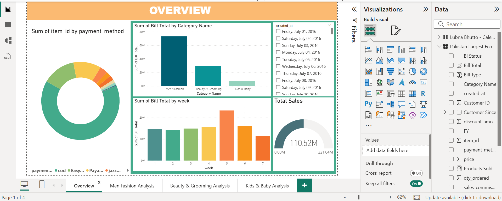
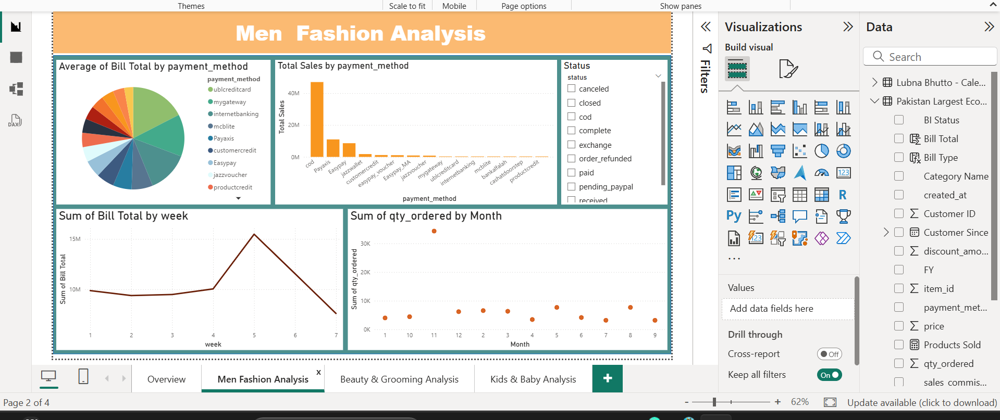
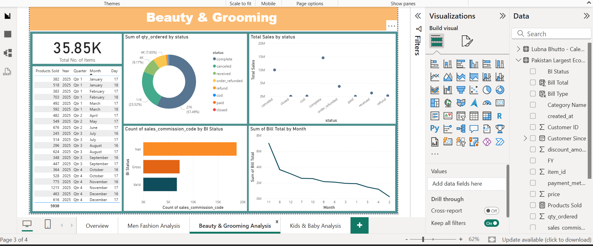
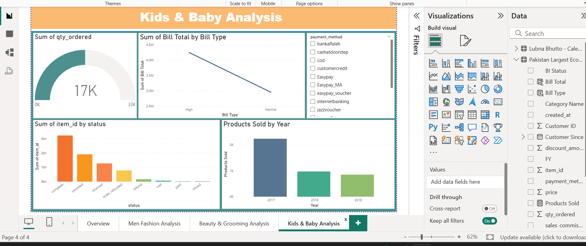

# Pakistan’s Largest E-Commerce Data Analysis — Power BI Dashboard
## Project Overview
This project presents an interactive Power BI dashboard analysis built using Pakistan’s largest e-commerce dataset. The goal of this project is to transform raw transactional data into meaningful visual insights that help understand sales performance, category trends, and customer purchasing behavior.

# Objectives

* Analyze overall e-commerce sales performance

* Identify trends across major product categories

* Understand customer purchasing patterns

* Present insights using interactive dashboards

* Practice real-world data visualization and analysis workflow
  

# Tools & Technologies Used

* Power BI

* Microsoft Excel (Data Cleaning & Preparation)

* Data Visualization Techniques

* Basic Data Analysis

# Dashboards Included

## Overview Dashboard

* Overall sales and order performance

* Category-wise contribution

## Men Fashion Analysis

* Sales trends in the men’s fashion category

* Category performance comparison

## Beauty & Grooming Analysis

* Product category performance

* Customer buying trends

## Kids & Baby Analysis

* Sales analysis of kids' and baby products

* Demand trends across categories

# Dashboard Preview

## Overview Dashboard

## Men Fashion Analysis

## Beauty & Grooming Analysis

## Kids & Baby Analysis

# Dataset Information

The original dataset used in this project is large and not included in this repository.
A sample dataset is provided to demonstrate data structure and fields used during analysis.

# Author

Lubna Bhutto
BS Computer Science - 6th Semester
Skills: Power BI, SQL, Python, Excel, Data Visualization

